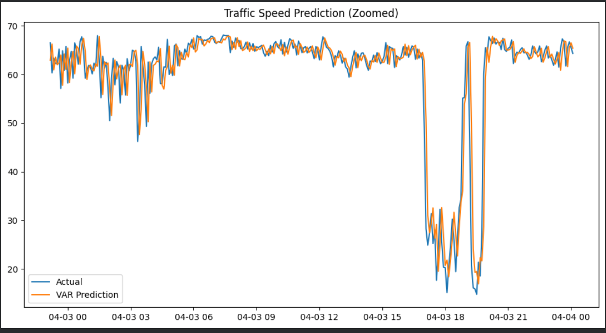
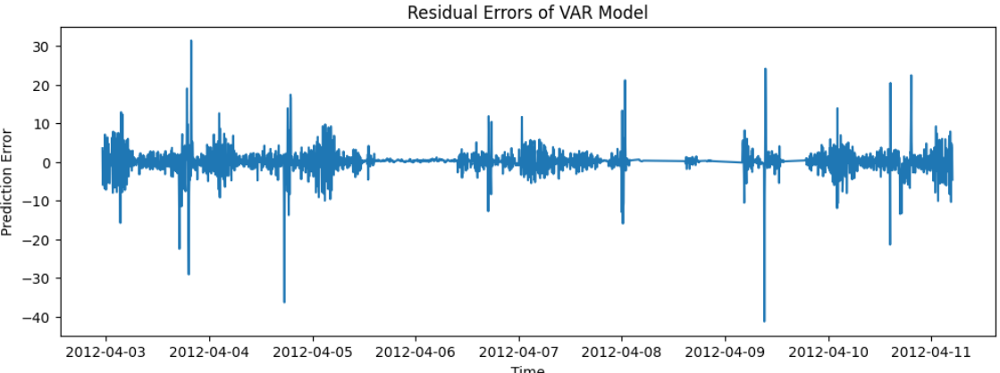
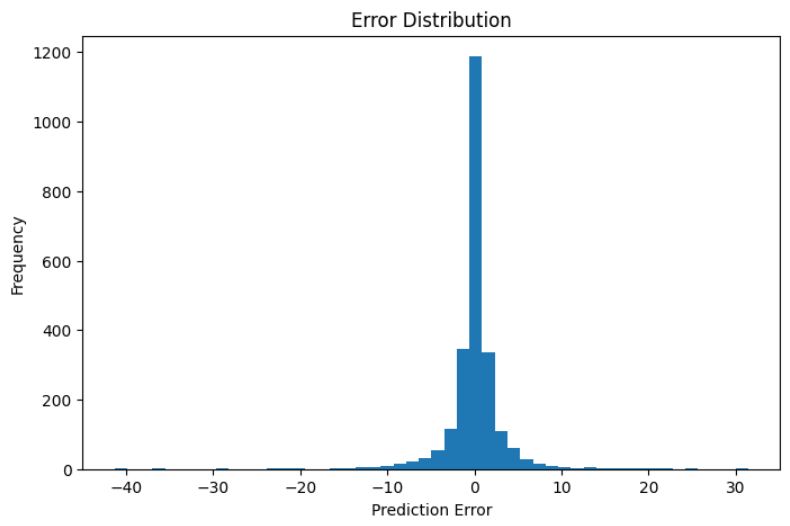

# 🚦 Time-Series-Based Traffic Congestion Prediction

A machine learning project that predicts **short-term traffic congestion levels** using **time-series forecasting models** and **hybrid deep learning techniques**.

This project compares **statistical models (ARIMA, VAR)** and **hybrid models (ARIMA + LSTM, VAR + LSTM)** to analyze how effectively they capture **temporal and spatial traffic patterns**.

---

# 📌 Project Overview

Urban traffic congestion is a major challenge in modern transportation systems. Accurate prediction of traffic flow helps improve traffic management, reduce travel time, and optimize route planning.

This project develops a **traffic congestion prediction framework** using statistical time-series models and deep learning techniques trained on real-world traffic sensor data.

Key goals of the project:

- Predict short-term traffic speed
- Compare statistical and hybrid models
- Capture both temporal and spatial traffic patterns

---

# 📊 Dataset

**Dataset Used:** A Large Scale PeMS Traffic Speed Dataset(pems-4w)

 is a traffic speed data set collected by California Freeway Performance Measurement System (PeMS). In this data set, it has 11160 time series corresponding to 11160 sensors/locations. In three data files (i.e., pems-4w.csv, pems-8w.csv, and pems-12w.csv), each time series is indeed a time series with 288 (5-minute) time points per day during the first 4 weeks (PeMS-4W), first 8 weeks (PeMS-8W), and first 12 weeks (PeMS-12W) of 2018, respectively.
Link : "https://zenodo.org/records/3939793"
### Key Features

- **Timestamp** – Time of traffic measurement  
- **Sensor ID** – Unique traffic sensor identifier  
- **Traffic Speed** – Vehicle speed recorded every 5 minutes  

Each sensor represents a road segment, enabling the model to capture **spatial relationships between traffic locations**.

---

# 🧠 Models Implemented

## 1️⃣ ARIMA (Autoregressive Integrated Moving Average)

ARIMA is a statistical time-series model used as a baseline for traffic prediction.

**Capabilities**

- Captures trends in traffic data
- Handles seasonality
- Effective for univariate time-series forecasting

**Limitation**

- Cannot capture complex nonlinear traffic patterns.

---

## 2️⃣ VAR (Vector AutoRegression)

VAR is a multivariate time-series model that captures relationships between multiple traffic sensors.

**Advantages**

- Captures spatial dependencies between sensors
- Uses multivariate traffic data
- Improves prediction accuracy

Example VAR formulation:

```
Yt = c + A1Yt−1 + A2Yt−2 + ... + A12Yt−12 + εt
```

The project uses **VAR(12)**, meaning the model uses **previous 12 time steps (60 minutes)** of data for prediction.

---

## 3️⃣ ARIMA + LSTM (Hybrid Model)

This hybrid approach improves ARIMA predictions by learning **nonlinear residual patterns using LSTM**.

**Workflow**

1. ARIMA predicts baseline traffic speed
2. Residual errors are computed
3. LSTM learns residual patterns
4. Final prediction = ARIMA prediction + LSTM residual

---

## 4️⃣ VAR + LSTM (Hybrid Model)

Similar to ARIMA + LSTM, but uses VAR predictions.

Purpose of this hybrid model:

- VAR captures spatial relationships
- LSTM captures nonlinear temporal dynamics

---

# ⚙️ Methodology

Project workflow:

```
Traffic Dataset
       ↓
Data Preprocessing
       ↓
Sensor Selection
       ↓
Stationarity Test (ADF Test)
       ↓
   ┌───────────┬───────────┐
   ↓           ↓
 ARIMA        VAR
   ↓           ↓
Prediction   Prediction
   ↓           ↓
Residual     Residual
   ↓           ↓
     LSTM Models
         ↓
   Hybrid Prediction
         ↓
   Model Comparison
```

---

# 🧪 Model Training Configuration

LSTM architecture used in the hybrid model:

- **Sequence Length:** 10 timesteps
- **Epochs:** 20
- **Batch Size:** 32
- **Optimizer:** Adam
- **Loss Function:** Mean Squared Error (MSE)

Architecture:

```
Input Sequence
     ↓
LSTM Layer
     ↓
LSTM Layer
     ↓
Dense Layer
     ↓
Traffic Speed Prediction
```

---

# 📈 Results

Model performance was evaluated using **RMSE (Root Mean Square Error)** and **MAE (Mean Absolute Error)**.

| Model | RMSE | MAE |
|------|------|------|
| ARIMA | 11.19 | 5.94 |
| VAR | 3.24 | 1.67 |
| ARIMA + LSTM | 3.29 | 2.04 |
| VAR + LSTM | 3.36 | 2.08 |

### Observations

- ARIMA shows higher prediction error.
- VAR significantly improves prediction accuracy.
- Hybrid models provide only marginal improvement over VAR.

---

# 📊 Visualization

## Traffic Speed Prediction





This graph compares **actual traffic speed vs predicted traffic speed**.

---

## Residual Error Analysis





Residual errors are centered around zero, indicating accurate predictions.

---

## Error Distribution





The histogram shows that prediction errors are mostly small and normally distributed.

---

# 💡 Key Contributions

- Comparative analysis of statistical and hybrid models
- Integration of multivariate traffic sensor data
- Implementation of hybrid time-series and deep learning models
- Performance evaluation using real-world traffic dataset

---

# ⚠️ Limitations

- Limited number of sensors used
- Short prediction horizon
- Hybrid deep learning models require longer training time

---

# 🔮 Future Work

Possible improvements for future research:

- Graph Neural Networks for spatial traffic modeling
- Long-term traffic forecasting
- Real-time traffic prediction systems
- Integration with smart city infrastructure

---

# 🛠️ Tech Stack

- Python
- Pandas
- NumPy
- Statsmodels
- TensorFlow / Keras
- Matplotlib
- Scikit-learn

---

# 📁 Project Structure

```
Traffic-Congestion-Prediction
│
├── data
│
├── notebook
│   └── traffic_prediction.ipynb
│
├── images
│   ├── methodology.png
│   ├── prediction.png
│   ├── residuals.png
│   └── error_distribution.png
│
└── README.md
```

---

# 📚 References

- Li et al., **Diffusion Convolutional Recurrent Neural Network**, ICLR 2018  
- Yu et al., **Spatio-Temporal Graph Convolutional Networks**, IJCAI 2018  
- Wu et al., **Graph WaveNet for Traffic Forecasting**, IJCAI 2019  
- Box & Jenkins, **Time Series Analysis: Forecasting and Control**

---

# 👨‍💻 Authors

Team 18

- Geethesh Karthikeyan  
- Sai Charan  
- Viswesh  
- Ketan Sairam

---

⭐ If you found this project useful, consider giving the repository a star.
